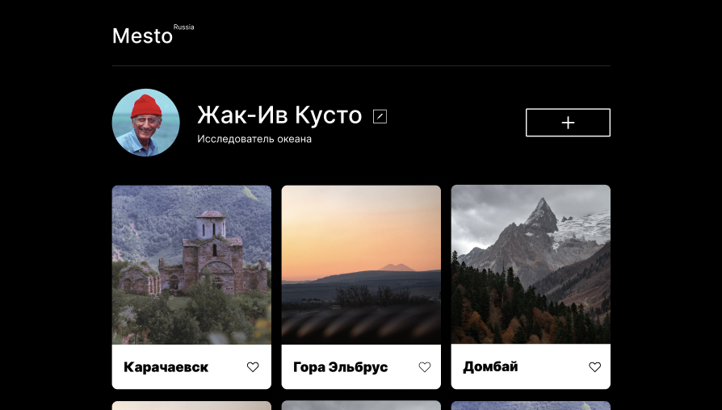

# Проект: Mesto (Место)
*[Ссылка проект](https://AnastasiiaKunstman.github.io/react-mesto-auth/)

сервиc Mesto это интерактивная страница, куда можно добавлять фотографии, удалять их, ставить лайки, редактировать информацию о себе и аватар.

*Проект выполнен на русском языке при помощи React. Минимальная ширина страницы - 320px, максимальная ширна - 1240px.*